# pretext.cool — Pretext Community Demo Collection

> **[pretext.cool](https://www.pretext.cool)** — 17+ interactive demos, games, and typography experiments built with [`@chenglou/pretext`](https://github.com/chenglou/pretext), the DOM-free text layout engine that's 500x faster than traditional browser layout.

<p align="center">
  <a href="https://www.pretext.cool"></a>
  <a href="https://github.com/chenglou/pretext"></a>
  <a href="https://www.npmjs.com/package/@chenglou/pretext"></a>
</p>

---

## Preview

<p align="center">
  <a href="https://www.pretext.cool">
    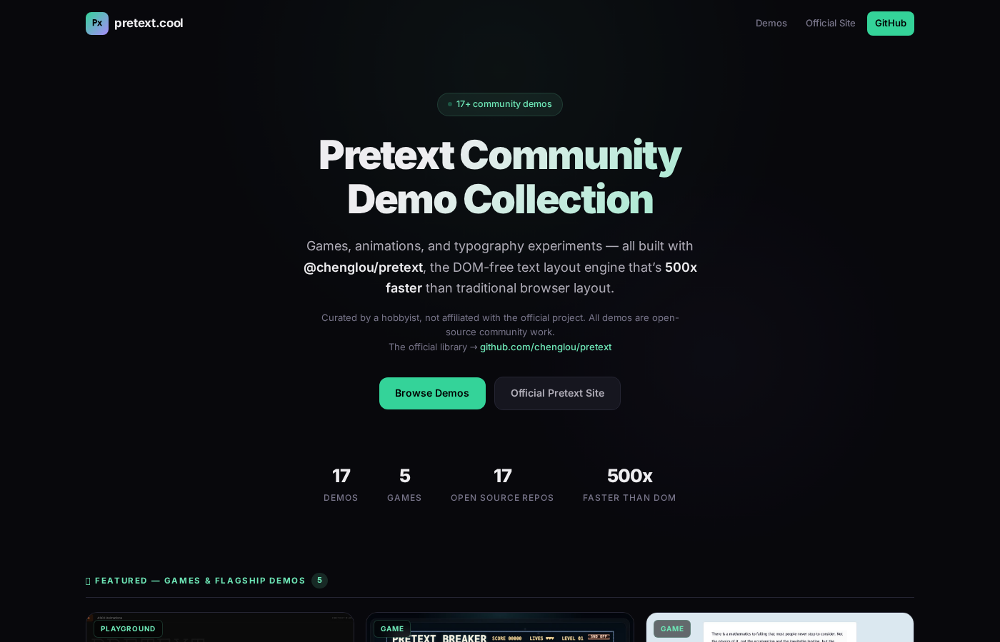
  </a>
</p>

<p align="center"><em>Homepage — Browse 17 demos, 5 games, all open source</em></p>

### Games

<table>
  <tr>
    <td align="center" width="33%">
      <a href="https://www.pretext.cool/hub?demo=pretext-playground">
        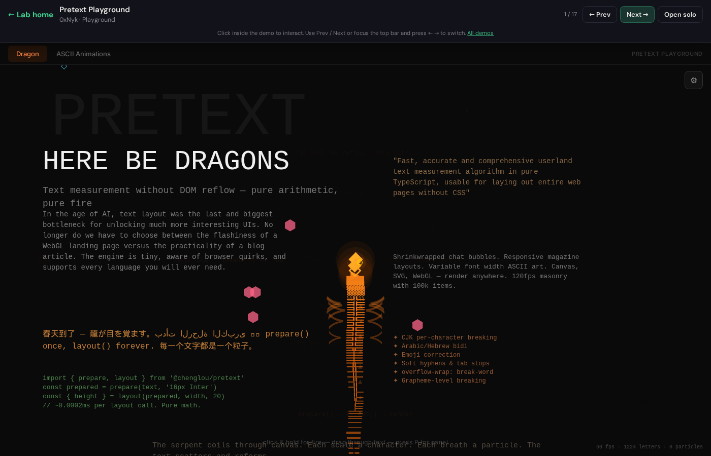
      </a>
      <br/><strong>Pretext Playground</strong><br/><sub>Interactive sandbox &middot; 0xNyk</sub>
    </td>
    <td align="center" width="33%">
      <a href="https://www.pretext.cool/hub?demo=pretext-breaker">
        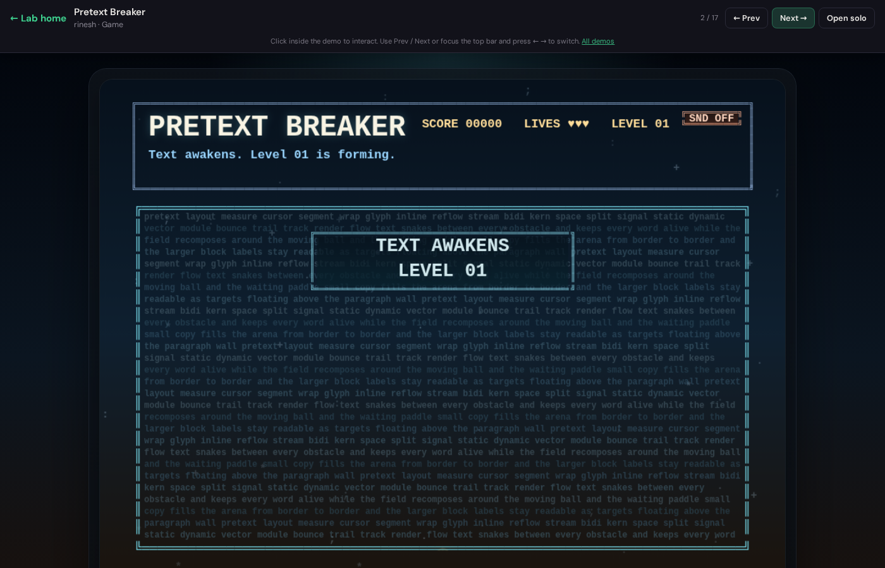
      </a>
      <br/><strong>Pretext Breaker</strong><br/><sub>Breakout game &middot; rinesh</sub>
    </td>
    <td align="center" width="33%">
      <a href="https://www.pretext.cool/hub?demo=tetris-pretext">
        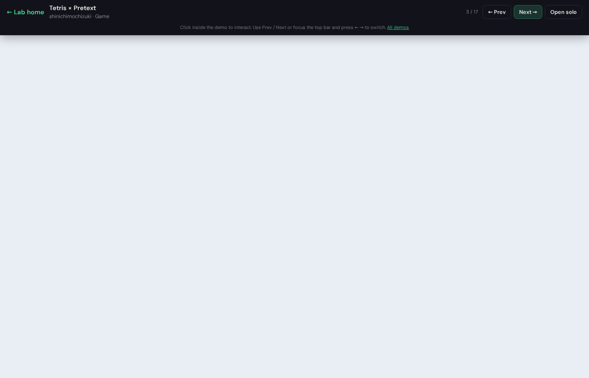
      </a>
      <br/><strong>Tetris &times; Pretext</strong><br/><sub>Tetris game &middot; shinichimochizuki</sub>
    </td>
  </tr>
</table>

### Animations & Visual

<table>
  <tr>
    <td align="center" width="33%">
      <a href="https://www.pretext.cool/hub?demo=pre-text-experiments">
        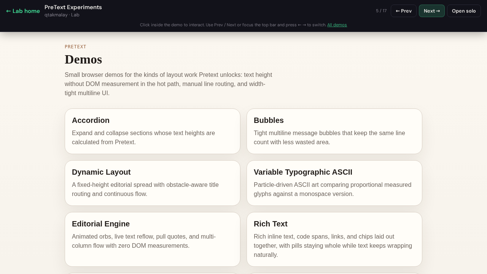
      </a>
      <br/><strong>PreText Experiments</strong><br/><sub>Dragon + Anime Walk &middot; qtakmalay</sub>
    </td>
    <td align="center" width="33%">
      <a href="https://www.pretext.cool/hub?demo=somnai-demos">
        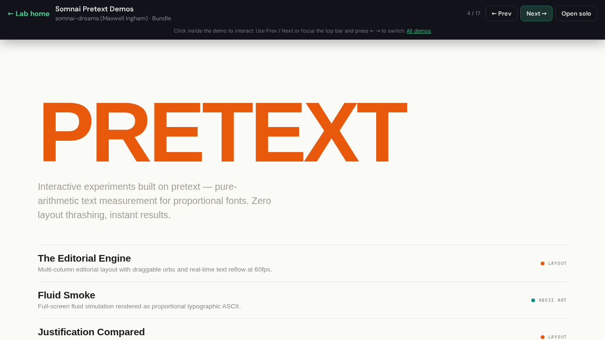
      </a>
      <br/><strong>Somnai Demos</strong><br/><sub>5-demo bundle &middot; Maxwell Ingham</sub>
    </td>
    <td align="center" width="33%">
      <a href="https://www.pretext.cool/hub?demo=pretext-explosive">
        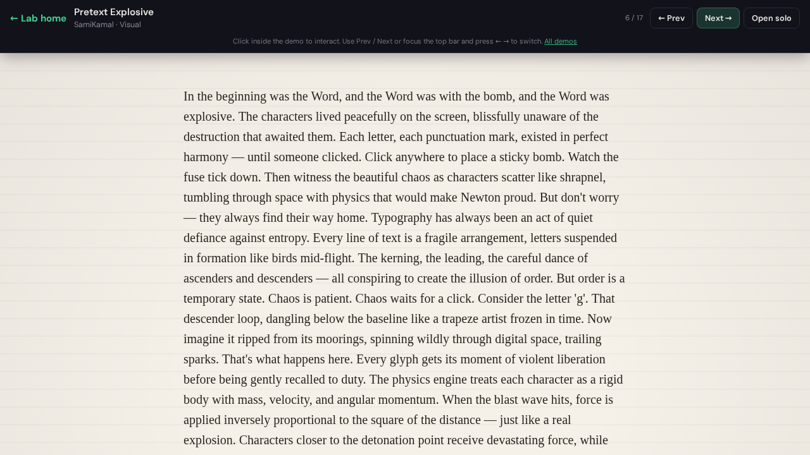
      </a>
      <br/><strong>Pretext Explosive</strong><br/><sub>Text particles &middot; SamiKamal</sub>
    </td>
  </tr>
  <tr>
    <td align="center" width="33%">
      <a href="https://www.pretext.cool/hub?demo=star-wars-opening">
        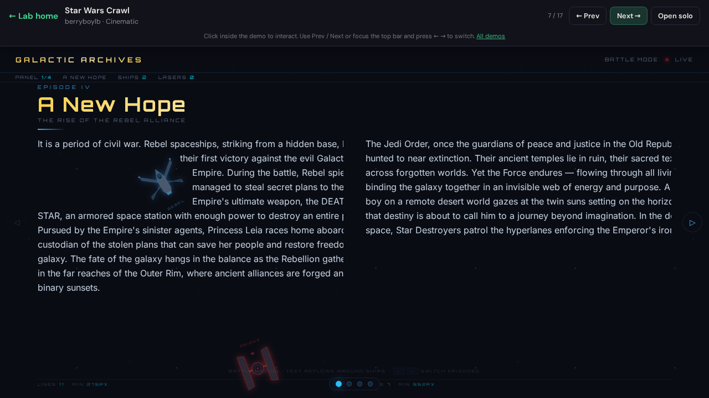
      </a>
      <br/><strong>Star Wars Crawl</strong><br/><sub>Cinematic text &middot; berryboylb</sub>
    </td>
    <td align="center" width="33%">
      <a href="https://www.pretext.cool/hub?demo=illustrated-manuscript">
        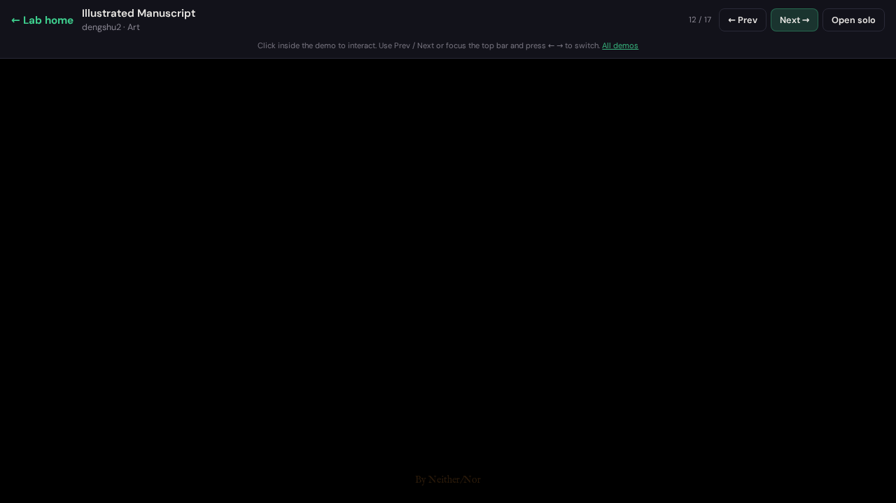
      </a>
      <br/><strong>Illustrated Manuscript</strong><br/><sub>Medieval art &middot; dengshu2</sub>
    </td>
    <td align="center" width="33%">
      <a href="https://www.pretext.cool/hub?demo=sea-of-words">
        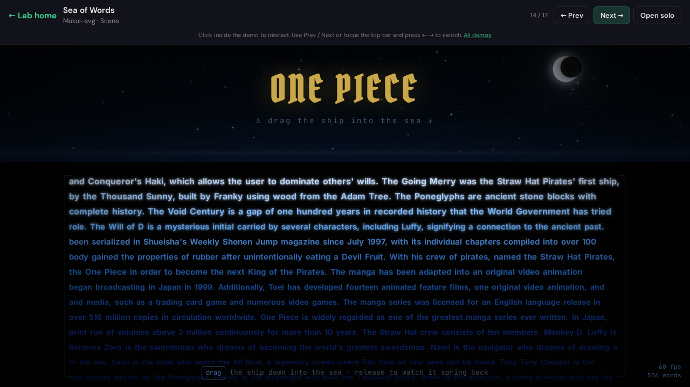
      </a>
      <br/><strong>Sea of Words</strong><br/><sub>Ocean text scene &middot; Mukul-svg</sub>
    </td>
  </tr>
</table>

### Interaction & Experiments

<table>
  <tr>
    <td align="center" width="33%">
      <a href="https://www.pretext.cool/hub?demo=progrmoiz-collection">
        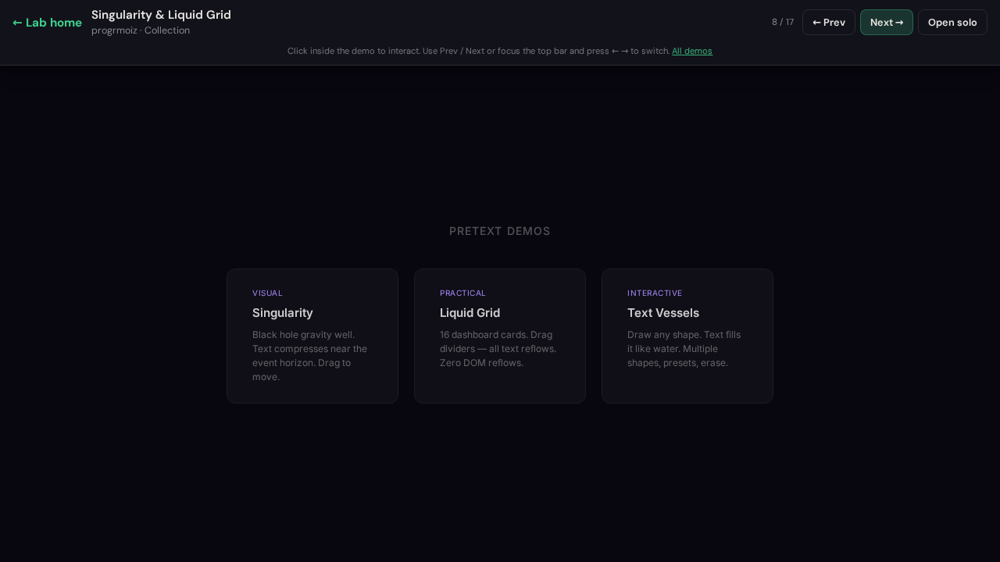
      </a>
      <br/><strong>Singularity & Liquid Grid</strong><br/><sub>Black hole + dashboard &middot; progrmoiz</sub>
    </td>
    <td align="center" width="33%">
      <a href="https://www.pretext.cool/hub?demo=dokobot-drag">
        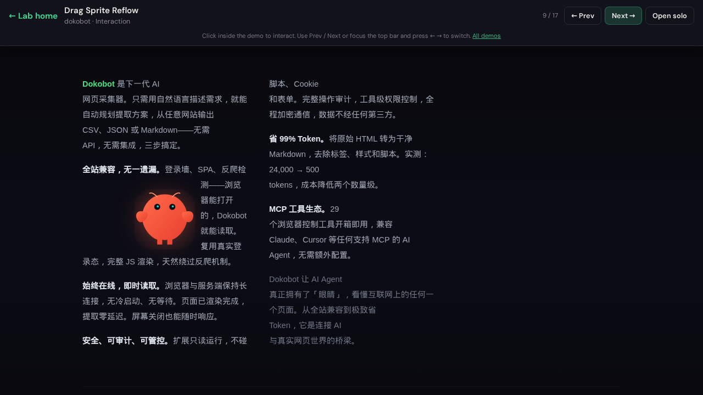
      </a>
      <br/><strong>Drag Sprite Reflow</strong><br/><sub>Interactive reflow &middot; dokobot</sub>
    </td>
    <td align="center" width="33%">
      <a href="https://www.pretext.cool/hub?demo=alarmy">
        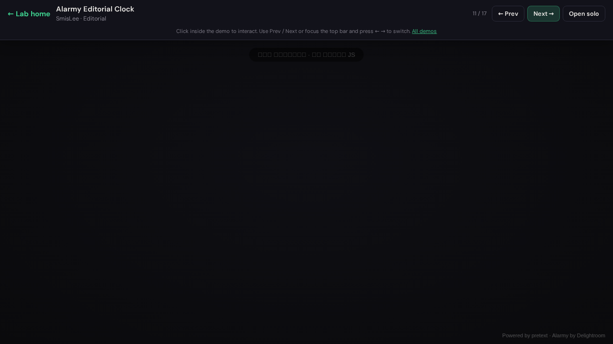
      </a>
      <br/><strong>Alarmy Editorial Clock</strong><br/><sub>Multi-column &middot; SmisLee</sub>
    </td>
  </tr>
  <tr>
    <td align="center" width="33%">
      <a href="https://www.pretext.cool/hub?demo=jalada-testimonials">
        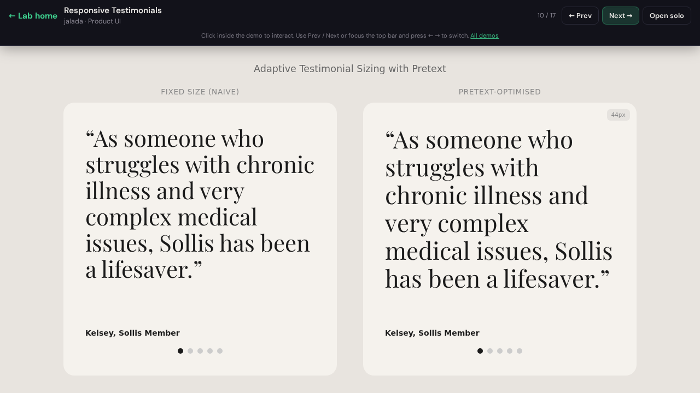
      </a>
      <br/><strong>Responsive Testimonials</strong><br/><sub>Product UI &middot; jalada</sub>
    </td>
    <td align="center" width="33%">
      <a href="https://www.pretext.cool/hub?demo=text-flow">
        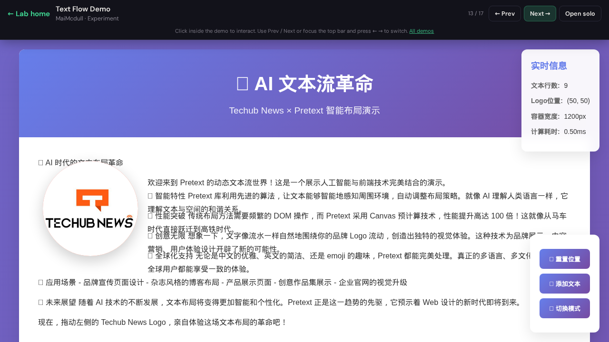
      </a>
      <br/><strong>Text Flow Demo</strong><br/><sub>Experiment &middot; MaiMcdull</sub>
    </td>
    <td align="center" width="33%">
      <a href="https://www.pretext.cool/hub?demo=world-model">
        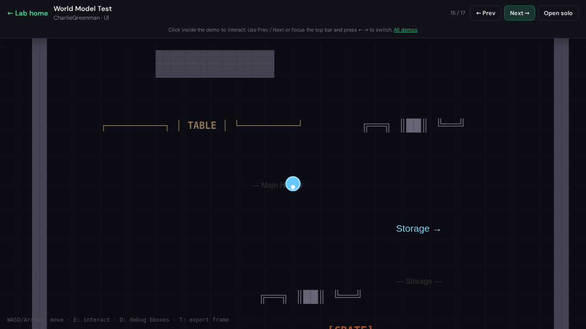
      </a>
      <br/><strong>World Model Test</strong><br/><sub>UI &middot; CharlieGreenman</sub>
    </td>
  </tr>
  <tr>
    <td align="center" width="33%">
      <a href="https://www.pretext.cool/hub?demo=sachinkasana-face">
        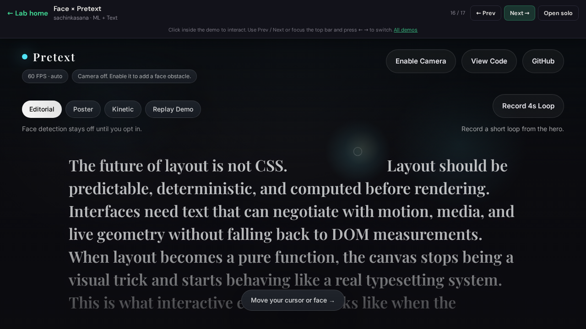
      </a>
      <br/><strong>Face &times; Pretext</strong><br/><sub>TF.js + text &middot; sachinkasana</sub>
    </td>
    <td align="center" width="33%">
      <a href="https://www.pretext.cool/hub?demo=clawsuo-dom-vs-pretext">
        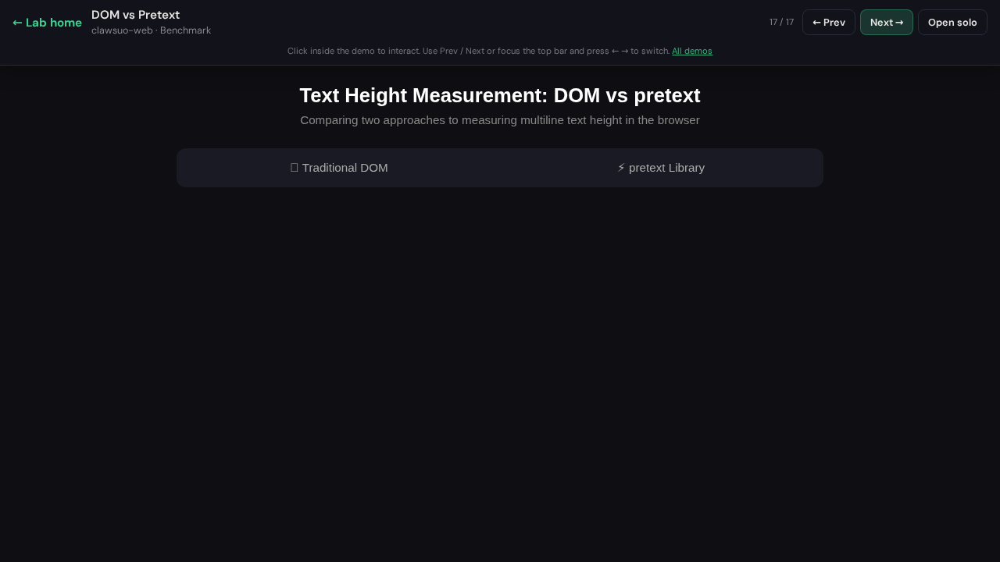
      </a>
      <br/><strong>DOM vs Pretext</strong><br/><sub>Performance benchmark &middot; clawsuo-web</sub>
    </td>
    <td align="center" width="33%"></td>
  </tr>
</table>

---

## What is this?

[**pretext.cool**](https://www.pretext.cool) is a curated collection of the best community-built demos and games powered by [Pretext](https://github.com/chenglou/pretext) — Cheng Lou's TypeScript library for DOM-free text layout.

We collect, build, and host these demos in one place so you can explore, play, and get inspired — without hunting across dozens of repos.

---

## What is Pretext?

[Pretext](https://github.com/chenglou/pretext) is a TypeScript library by **Cheng Lou** (React core contributor, ReasonML creator, Midjourney engineer). It measures and positions text using Canvas instead of the DOM, then computes layout with pure arithmetic — making text reflow **~500x faster** than traditional browser methods.

```
prepare()  →  one-time Canvas measurement (~19ms / 500 texts)
layout()   →  pure arithmetic reflow    (~0.09ms / 500 texts)
```

- **GitHub**: [github.com/chenglou/pretext](https://github.com/chenglou/pretext)
- **npm**: [`@chenglou/pretext`](https://www.npmjs.com/package/@chenglou/pretext)
- **Official Demos**: [chenglou.me/pretext](https://chenglou.me/pretext/)
- **Author**: [Cheng Lou](https://chenglou.me)

---

## Demo Collection

### 🎮 Games

| Demo | Author | Description | Play |
|------|--------|-------------|------|
| **Pretext Playground** | 0xNyk | Interactive ASCII dragon, physics letters, fire breathing, 3D text tunnel | [▶ Play](https://www.pretext.cool/hub?demo=pretext-playground) |
| **Pretext Breaker** | rinesh | Breakout-style arcade — bricks made of text, with sound effects | [▶ Play](https://www.pretext.cool/hub?demo=pretext-breaker) |
| **Tetris × Pretext** | shinichimochizuki | Classic Tetris with Pretext-powered text layout | [▶ Play](https://www.pretext.cool/hub?demo=tetris-pretext) |

### 🐉 Animations & Visual

| Demo | Author | Description | Play |
|------|--------|-------------|------|
| **PreText Experiments** | qtakmalay | Dragon animation, Anime Walk, and 9 more TypeScript demos | [▶ Play](https://www.pretext.cool/hub?demo=pre-text-experiments) |
| **Somnai Demos** | Maxwell Ingham | 5 polished demos: editorial engine, fluid smoke ASCII, variable typography | [▶ Play](https://www.pretext.cool/hub?demo=somnai-demos) |
| **Pretext Explosive** | SamiKamal | Text that shatters into particles | [▶ Play](https://www.pretext.cool/hub?demo=pretext-explosive) |
| **Star Wars Crawl** | berryboylb | The iconic opening crawl with perspective text animation | [▶ Play](https://www.pretext.cool/hub?demo=star-wars-opening) |
| **Illustrated Manuscript** | dengshu2 | Medieval illuminated manuscript with animated dragon | [▶ Play](https://www.pretext.cool/hub?demo=illustrated-manuscript) |
| **Sea of Words** | Mukul-svg | Text as ocean waves in a canvas scene | [▶ Play](https://www.pretext.cool/hub?demo=sea-of-words) |

### 🔬 Interaction & Experiments

| Demo | Author | Description | Play |
|------|--------|-------------|------|
| **Singularity & Liquid Grid** | progrmoiz | Black hole text effect + liquid dashboard + text vessels | [▶ Play](https://www.pretext.cool/hub?demo=progrmoiz-collection) |
| **Drag Sprite Reflow** | dokobot | Drag a sprite and watch text reflow in real time | [▶ Play](https://www.pretext.cool/hub?demo=dokobot-drag) |
| **Alarmy Editorial Clock** | SmisLee | Multi-column editorial flowing around an animated clock | [▶ Play](https://www.pretext.cool/hub?demo=alarmy) |
| **Responsive Testimonials** | jalada | Auto-sizing quotes with Pretext measurement | [▶ Play](https://www.pretext.cool/hub?demo=jalada-testimonials) |
| **Face × Pretext** | sachinkasana | TensorFlow.js face tracking drives real-time typography | [▶ Play](https://www.pretext.cool/hub?demo=sachinkasana-face) |
| **Text Flow Demo** | MaiMcdull | News-style flowing layout with benchmark comparison | [▶ Play](https://www.pretext.cool/hub?demo=text-flow) |
| **DOM vs Pretext** | clawsuo-web | Side-by-side performance benchmark | [▶ Play](https://www.pretext.cool/hub?demo=clawsuo-dom-vs-pretext) |
| **World Model Test** | CharlieGreenman | Minimal world-model UI experiment | [▶ Play](https://www.pretext.cool/hub?demo=world-model) |

### 🔗 External Demos

| Demo | Link |
|------|------|
| **Official Pretext Demos** (Cheng Lou) | [chenglou.me/pretext](https://chenglou.me/pretext/) |
| **Dragon Through Text** (aiia.ro) | [aiia.ro/pretext](https://aiia.ro/pretext/) |
| **Pretext Breaker** (Netlify) | [pretext-breaker.netlify.app](https://pretext-breaker.netlify.app) |

---

## How the Site Works

[pretext.cool](https://www.pretext.cool) is a static HTML hub — no framework needed. Each demo is a self-contained build from its open-source repo, served from a `/demos/` directory. A lab shell provides prev/next navigation across all demos in one iframe player.

```
pretext.cool/
├── index.html              # Collection landing page
├── hub.html                # Lab shell (iframe player)
├── demos-manifest.json     # Demo metadata & GitHub links
├── demos/                  # 17 built demo artifacts
│   ├── pretext-playground/
│   ├── pretext-breaker/
│   ├── tetris-pretext/
│   └── ...
├── sitemap.xml
└── robots.txt
```

---

## Community Source Repos

All demos are open-source. Here are the repos we've collected from:

<details>
<summary>View all 17 source repositories</summary>

| Demo | Repository |
|------|-----------|
| Pretext Playground | [0xNyk/pretext-playground](https://github.com/0xNyk/pretext-playground) |
| Pretext Breaker | [rinesh/pretext-breaker](https://github.com/rinesh/pretext-breaker) |
| Tetris × Pretext | [shinichimochizuki/tetris-pretext](https://github.com/shinichimochizuki/tetris-pretext) |
| Somnai Demos | [somnai-dreams/pretext-demos](https://github.com/somnai-dreams/pretext-demos) |
| PreText Experiments | [qtakmalay/PreTextExperiments](https://github.com/qtakmalay/PreTextExperiments) |
| Pretext Explosive | [SamiKamal/pretext-explosive](https://github.com/SamiKamal/pretext-explosive) |
| Star Wars Crawl | [berryboylb/star-wars-pretext-demo](https://github.com/berryboylb/star-wars-pretext-demo) |
| Singularity & Liquid Grid | [progrmoiz/pretext-demos](https://github.com/progrmoiz/pretext-demos) |
| Drag Sprite Reflow | [dokobot/pretext-demo](https://github.com/dokobot/pretext-demo) |
| Responsive Testimonials | [jalada/pretext-demo](https://github.com/jalada/pretext-demo) |
| Alarmy Editorial Clock | [SmisLee/alarmy-pretext-demo](https://github.com/SmisLee/alarmy-pretext-demo) |
| Illustrated Manuscript | [dengshu2/illustrated-manuscript](https://github.com/dengshu2/illustrated-manuscript) |
| Text Flow Demo | [MaiMcdull/pretext-text-flow-demo](https://github.com/MaiMcdull/pretext-text-flow-demo) |
| Sea of Words | [Mukul-svg/sea-of-words](https://github.com/Mukul-svg/sea-of-words) |
| World Model Test | [CharlieGreenman/world-model-test](https://github.com/CharlieGreenman/world-model-test) |
| Face × Pretext | [sachinkasana/pretext-demo](https://github.com/sachinkasana/pretext-demo) |
| DOM vs Pretext | [clawsuo-web/pretext-demo](https://github.com/clawsuo-web/pretext-demo) |

</details>

---

## Disclaimer

This is a **hobby project** by an independent developer. Not affiliated with, endorsed by, or connected to Cheng Lou or the official Pretext project. All demo source code belongs to their respective authors. We simply celebrate and showcase the amazing community that has grown around Pretext.

---

## Links

- 🌐 **Live Site**: [pretext.cool](https://www.pretext.cool)
- 📦 **Official Library**: [github.com/chenglou/pretext](https://github.com/chenglou/pretext)
- 📖 **npm Package**: [@chenglou/pretext](https://www.npmjs.com/package/@chenglou/pretext)
- 🎯 **Official Demos**: [chenglou.me/pretext](https://chenglou.me/pretext/)
